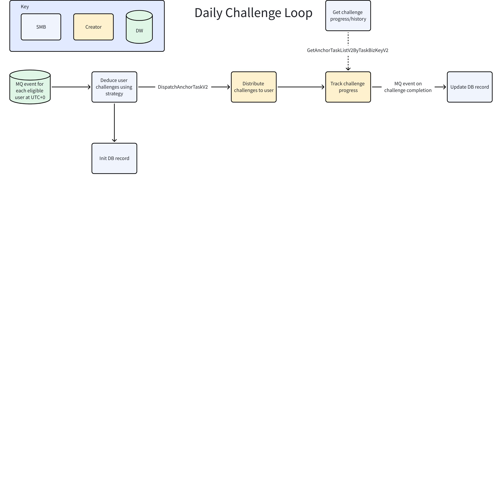
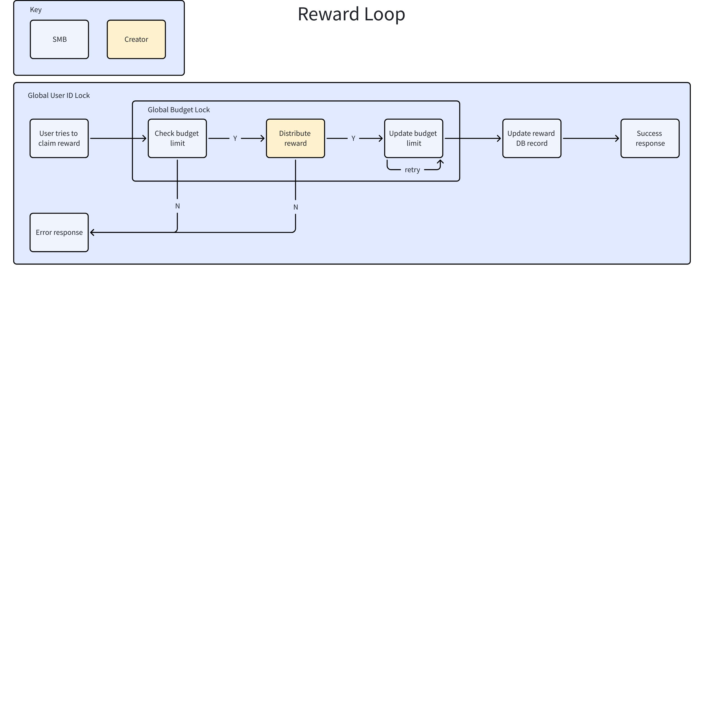
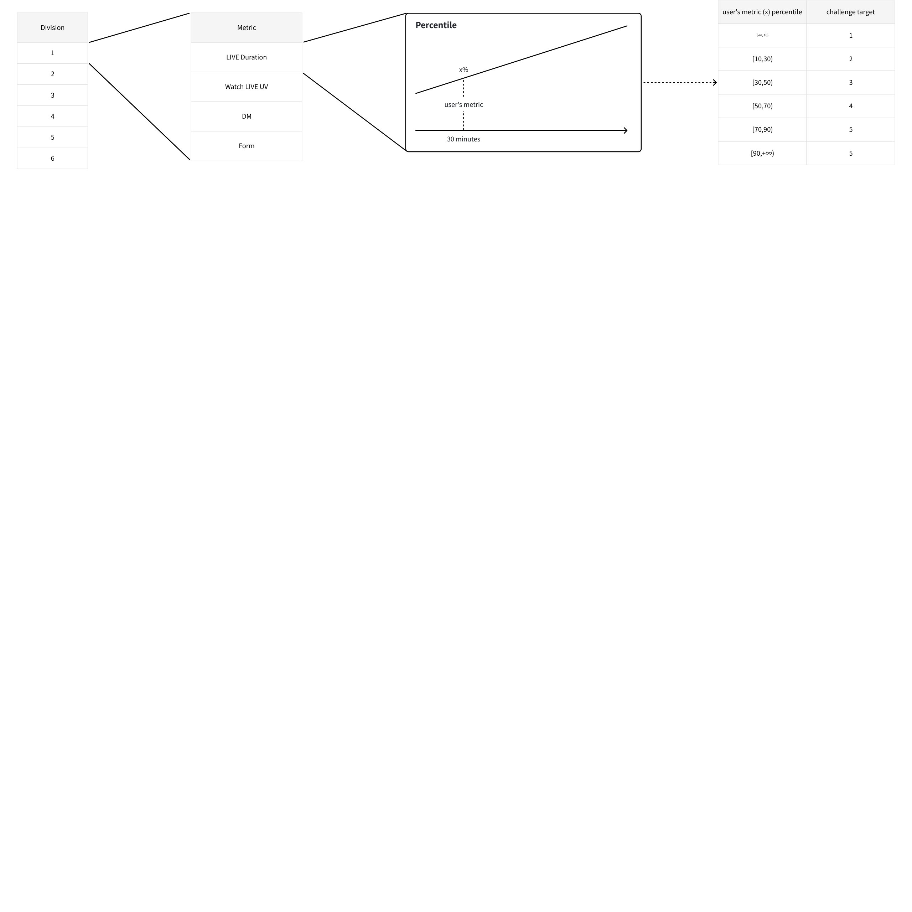

# Promotion Document - Max Owen (1-2 -> 2-1)

# Basic Information

## Education

> 2019 - 2022

UNSW: Bachelor of Engineering (Honours)

## Work Experience

> February 2021 - December 2022

UNSW: Engineering Tutor

> November 2021 - February 2022
> September 2022 - December 2022

Optiver: Software Developer Intern

> February 2023 - August 2023

Optiver: Graduate Software Developer

> November 2023 - present

TikTok: Backend Software Engineer

# Job Responsibilities

## Team - Subscription & SMB Server, TikTok LIVE

The Subscription & SMB (Small and Medium-sized Businesses) Server team is responsible for the backend systems that power core monetisation and growth features for creators on TikTok LIVE. This includes the end-to-end lifecycle of creator subscriptions (until ownership moved to another team in 2025), incentive programs, and tools designed to help SMB creators utilise LIVE for their businesses. In 2024 the team operated as the Subscription team focused on subscription features. In 2025 it transitioned to the SMB team with a focus on SMB/Leads features. While subscription business ownership has since been handed over, the subscription work described in this document was delivered within that earlier scope and remains relevant for this promotion case. The team's work directly impacts creator retention, monetisation, and the overall health of the LIVE ecosystem. Across the projects below, my work has consistently involved cross-timezone and cross-language collaboration.

## Role

As a backend engineer on the team, my work focuses on the design, implementation, and maintenance of server-side logic for key creator-facing features. My responsibilities include:

- Owning the technical design and delivery of new features and services, from requirement analysis to launch and post-launch monitoring.
- Developing and maintaining robust, scalable, and reliable backend systems, with a strong emphasis on fund safety and data correctness.
- Collaborating with cross-functional and cross-timezone teams, including product, frontend, mobile, QA, and data science, to deliver complex projects.
- Participating in on-call rotations, resolving production issues, and contributing to the operational excellence of the team's services.
- Providing technical and business guidance to junior engineers and interns.

A core principle of my work has been a commitment to system reliability. **N****o incidents have been caused by my work in over 2+ years at TikTok.**

# Key Projects

## Daily Challenges (V1 & V2)

### Background

Daily Challenges was introduced to incentivise and educate SMB creators, guiding them to adopt key LIVE features to grow their presence. The program presented creators with daily tasks, rewarding them with Promote coupons upon completion. The system required robust architecture to manage tasks, track progress, and distribute rewards while adhering to a strict budget. The project was split into two major versions, V1 for the initial rollout and V2 for subsequent enhancements. The detailed server-side design for V1 is captured in [Daily Challenges tech design](https://bytedance.larkoffice.com/wiki/RYPAwlrsYifD5bk0E2GcuKm4n4g).

### Responsibility

I was responsible for the majority of the server-side development for both V1 and V2. This included designing the core data models, implementing the task and reward lifecycle, building fund-safety guardrails, and collaborating with numerous cross-functional teams to ensure a successful launch.

### V1: Initial Implementation & Launch

#### Challenges

- **High Complexity & New Guardrails**: The initial version was a large-scale undertaking, requiring new RDS tables to manage challenges, rewards, and user state. A critical requirement was to build a fund-safety mechanism from scratch to manage a strict daily global budget of $60,000 USD, distributed across many regions.
- **Cross-Functional/Time-Zone Collaboration**: The project involved extensive collaboration with teams across different time zones and functions, including product, frontend, and data teams, to align on requirements and deliverables.
- **System Reliability**: The system needed to be highly reliable to ensure a smooth user experience and prevent any fund-related incidents.

#### Technical Solution

- **Season & Reward Lifecycle Model**: I designed and implemented a "season" model, where challenges would run for a 90-day period. This included the entire lifecycle management for tasks and rewards, from issuance to completion and claim.
- **Strict Budget Control**: To prevent over-issuance of rewards, I implemented hard budget checks. The system performed real-time validation against the daily $60,000 USD global cap, with per-region controls, ensuring that reward distribution would cease immediately once the budget was exhausted.
- **Data Modeling**: I designed and created new RDS tables (`smb_challenge`, `smb_challenge_threshold`) to store challenge data, user progress, reward states, and dynamic difficulty thresholds, ensuring data integrity and efficient querying.
- **Scalability and Performance**: With the creation of new services servicing millions of users, the system required latency and reliability optimisations.

#### Impact

- The first 90-day season of Daily Challenges was launched successfully with **zero incidents and no fund loss**, demonstrating the effectiveness of the fund-safety guardrails.
- The feature successfully incentivised creators, driving adoption of key LIVE features and contributing to creator growth.
- **DA highlights (AB results):**
    - **Reach & opt-in:** Reach UV / opt-in-eligible UV **+0.13%**, Opt-in UV / DAU **+1.6%**.
    - **Leads:** Opt-in LIVE UV per-capita leads **+10.8%**, per-capita pin card count **+15.5%**
    - **Promote:** White/grey creators’ UV order rate **+36.9%**, consume rate **+31.6%**, per-UV order amount **+8.4%**, residual order amount (excluding coupons) **+2.5%**, overall ROI > 1.
    - **ROI:** RoW cumulative ROI ≈ **1.47**, day-of V4-label creators ROI ≈ **1.54**, 45-day ROI ≈ **1.42**.

#### Diagrams

Representative architecture diagrams from the Daily Challenges tech design:

### V2: Iteration and Enhancement

#### Challenges

- **Adding New Task Types**: V2 required the introduction of more complex task types, such as "Promote" tasks, which involved integration with the Promote advertising system.
- **Regional Budget Flexibility**: The system needed to support early termination of a season in a specific region if its budget was exhausted, without affecting other regions.

### Engineering and Operations Highlights

#### Services and resource estimation

- For Daily Challenges I created and now own a small multi-service stack: one new TCE service (`tikcast.smb.challenge`), two new FaaS services (`tikcast.smb.challenge_scanner`, `tikcast.smb.challenge_processor`), and one new TCC service (`tikcast.smb.challenge`). This was my first time creating new services for a feature, and I am responsible for monitoring their health and responding to related alarms.
- Resourcing these new services was non-trivial. I iterated on resource estimates before converging on stable settings. The final estimates and rationale are captured in [Daily Challenges resource estimation](https://bytedance.larkoffice.com/wiki/IkEIw2fh0icLeYkOTOhcopfknwe).

#### State machine and debuggability

- The tech design explicitly documents every challenge and reward state (for example ongoing or completed challenges and unclaimable, claimable, claimed, or expired rewards). Having a clear state machine made it easier for RD and QA to debug issues and reason about edge cases.

#### Budget control architecture

- I evaluated several concurrency control models for the budget system. While a distributed transaction manager offered stronger consistency, it introduced significant latency and complexity. Given the modest QPS of reward claims, I chose a centralized Redis lock in a single IDC. This provided sufficient fund safety with minimal performance overhead and simpler implementation, striking the right balance between correctness and system complexity.
- The reward loop and budget path are captured in the Daily Challenges reward loop diagram above. 

#### Monitoring and visibility

- I set up an internal monitoring bot that reports Daily Challenges task completion and budget usage to shared channels visible to RDs, QA, and PMs, making anomalies easy to spot and follow up on.

#### Latency management and eligibility DAG

- The initial eligibility RPC combined seven sequential checks (four mandatory and three optional), which led to unacceptable latency after launch. I refactored the logic into a directed acyclic graph structure, so independent conditions can run in parallel after their respective dependencies have been fetched. The optimised logic is easily extensible for any future feature iterations. 
- This refactor significantly reduced p99 latency and left the code easier to extend. New conditions can be plugged into the DAG without rewriting the control flow. The final implementation is in [GetEligibilityHandler](https://code.byted.org/tikcast/smb_challenge/blob/master/handler/get_eligibility.go?ref_type=heads).

#### Difficulty and thresholds

- To set challenge difficulty, creators are grouped into six divisions based on recent performance metrics (ACU, LIVE watch time, leads, etc.). For each division, their daily metrics are written into Redis sorted sets for LIVE duration, UV, DMs, and forms.
- Once a month a scanner job reads these sorted sets, computes percentile thresholds (10th, 30th, 50th, 70th, 90th) for each metric, and writes them into the `smb_challenge_threshold` table. When issuing tasks for the next month, the system uses these thresholds to assign creators tasks one bracket higher than their current percentile, so challenges are achievable but still push behaviour. This logic is illustrated in the updated threshold diagram:

#### Optimisations

- As part of this feature, I refactored the SMB banners to a unified, extensible process. Previously, each banner was fetched separately using different APIs and collated by the client. Now, all banners in our business follow a generic structure (which aligns with the foundations team's own banner refactor) which allows for simple creation of new banners. 

## Subscription & Leads Opt-Out

### Background

The initial subscription and leads opt-in flows were designed for rapid growth, but they lacked a corresponding opt-out mechanism. This became a significant pain point for creators who had opted in by mistake or no longer wished to use the service. This project involved designing and building a comprehensive opt-out system for both Subscription and the related Leads service.

### Responsibility

I owned the server-side implementation for both the Subscription and Leads opt-out flows. This included handling the core logic, on-call resolutions for user feedback, and extensive cross-timezone collaboration with US-based teams.

### Challenges

- **Complex State Management**: The opt-out process required a cooling-off period, notifications, and the ability to reactivate, which introduced multiple new states that had to be managed correctly across the system.
- **Delayed Revocation for Leads**: For the Leads service, we couldn't immediately revoke access for creators who were no longer eligible. We had to provide a grace period with a clear notification timeline before their access was removed.
- **Cross-Timezone Collaboration**: The subscription project required tight collaboration with client teams in the US, which involved navigating difficult time zone differences to debug issues and ensure alignment.

### Technical Solution

- **Subscription Opt-Out Flow**:
    - I introduced new status fields to the `anchor_sub_status` table (`is_revoked`, `opt_out_time`, `opt_out_type`) and a new `opt_out_record` table to manage the lifecycle.
    - When a creator opts out, the system enters a 30-day "cooling period" (`OptOutCoolingPeriodRevoked` status), during which new subscriptions are blocked but existing ones remain active.
    - After the cooling period, the status changes to `OptOutRevoked`, and all remaining privileges are cleared. I also built the reactivation logic to allow creators to rejoin within the cooling period.
- **Leads Opt-Out Delayed Revocation**:
    - For creators who became ineligible for the Leads service (e.g., by selecting a blacklisted industry), I designed a delayed revocation flow using Eventbus.
    - Upon ineligibility, new fields in the `upsell` table (`upsell.will_revoke`, `upsell.revoke_time`) were set, and an initial event was sent to a delayed queue. The delay would be the time before the next inbox needed to be sent. This way, only one full table scan needed to be conducted to perform this flow for each user. 
    - This triggered a chain of delayed notices sent to the creator at 30d, 20d, 5d, 2d, and 1d before their access was finally revoked by setting `status=revoked`.
    - For creators who selected a blacklisted industry, a 3-day grace period was provided before initiating the revocation process.
    - All configurations were preserved, allowing for a seamless re-opt-in experience if the creator became eligible again.

### Impact

- Successfully delivered a much-needed opt-out capability for both Subscription and Leads, addressing a major creator pain point.
- For Leads Opt-Out, successfully revoked access for **over 100,000** creators whose leads permissions no longer matched targeting rules, while preserving configuration for any future reactivation.
- The delayed revocation flow for Leads provided a fair and transparent experience for creators, giving them ample notice before their access was removed.
- My ownership of the domain, including handling on-call issues and user feedback, ensured the feature was stable and met user expectations.

## Subscription Availability Revisit

### Background

A misconfiguration between an outdated payout availability document and the production blocklist logic led to creators in non-payout-supported regions being able to opt into and receive subscriptions. This created a fund-safety risk, as there was no mechanism to pay these creators. This project aimed to correct the misconfiguration, revoke access for ineligible creators, and refund their subscribers.

### Responsibility

I was the tech owner for the server-side solution. I was responsible for designing and implementing the cross-IDC revocation and refund process, ensuring correctness and fund safety throughout.

### Challenges

- **Cross-IDC Complexity**: Creators and their subscribers could be in different data centers (e.g., an anchor in TTP with subscribers in SG/VA). The solution needed to handle revocation and refunds across these different IDCs, which have separate RDS instances.
- **Data Integrity and Fund Safety**: The process of revoking access and issuing refunds had to be perfectly accurate to prevent any fund loss or user complaints. Simply deleting the anchor's opt-in record was not an option, as this would break the ability to process refunds for their subscribers in other DCs.
- **Large-Scale Operation**: The fix needed to be applied to hundreds of thousands of accounts across numerous regions, requiring a scalable and reliable execution plan.

### Technical Solution

- **"SoftRevoke" Implementation**: The primary challenge was ensuring data consistency across IDCs during revocation. A simple hard delete would orphan subscriber records in other regions, breaking refund workflows. I designed a `SoftRevoke` mechanism, using a status flag instead of deletion. This preserved the anchor record as a source of truth for downstream systems, ensuring refunds could be processed reliably. This idempotent approach was simpler and safer than implementing a complex two-phase commit across distributed databases.
- **Cross-IDC Revoke-and-Refund Process**: I designed a FaaS-based process that would run in each of the three major IDCs (SG/VA, IE/GCP, TTP1/2).
    1. The function would iterate through all opted-in anchors and identify those in regions that were not on the official payment allowlist.
    2. For each ineligible anchor, it would call `RevokeAnchorQualification` with `SoftRevoke=true`, revoking their access in their local IDC.
    3. It would then trigger the refund process (`HandleMPRefund`) for all of that anchor's subscribers. Since the anchor's record was preserved, this could be safely executed in each subscriber's respective IDC.
- **Allowlist Migration**: To prevent future misconfigurations, I migrated the system from a fragile region blocklist to an allowlist (`sub_c2c_trans_available_region`) sourced directly from the MP (Monetary Platform) team, ensuring that subscription availability would always be aligned with payment availability.

### Impact

- The project successfully corrected the subscription availability for a large number of creators, with the revocation of the subscribers of more than **500k** **creators globally**. These revoked anchors included, for example, approximately **108k** in UA, **90k** in IQ, and **43k** in RU (see "Revoked Regions" in the tech design).
- All affected subscribers were correctly refunded, and there were **no fund-safety incidents** or major user complaints, demonstrating the robustness of the SoftRevoke design.
- The migration to an allowlist provided a long-term solution, significantly reducing the risk of similar issues in the future.

## Subscription Incentive Program

### Background

The Subscription Incentive Program is a key driver for creator monetisation, rewarding creators with cash bonuses and feature unlocks as they reach certain subscriber milestones. This iteration aimed to enrich the program by adding more milestone tiers, introducing new reward types, and refining the underlying payout calculation to be more robust and fund-safe. Within that broader four-feature initiative, I owned two of the four server-side components: the milestone structure redesign and the incentive payout migration. The detailed technical design is documented in [Subscription Incentive Program tech design](https://bytedance.larkoffice.com/wiki/NZgzwJlR5il6IAkMW2uc2Xfsn2g).

### Responsibility

I was the primary server-side engineer responsible for the backend design and implementation. My work involved significant changes to the TCC configurations, database schema, and RPC services to support the new multi-reward milestone structure and the updated payout logic.

### Challenges

- **Complex Milestone Structure**: The existing milestone system supported only one reward per tier. The new design required supporting multiple rewards per tier, including a mix of cash bonuses, feature unlocks (e.g., emote slots, gift sub feature), and UI-based honors.
- **Fund-Safe Payout Logic Migration**: A critical requirement was to change the cash bonus calculation from being based on the creator's payout to being based on net revenue. This required a careful migration to ensure creators' earnings were not negatively impacted and to prevent any over- or under-issuance.
- **AB Experimentation**: The new milestone structure, particularly the addition of emote slots, needed to be rolled out as an AB experiment, requiring the system to support multiple milestone configurations simultaneously.

### Technical Solution

- **Multi-Reward TCC Structure**: I designed a new, more flexible TCC structure for `subscription_milestone_tiers`. The `tiers_payout` field was changed from an object to an array of objects, allowing multiple rewards (each with a `type`, `amount`, and `icon`) to be associated with a single milestone tier.
- **Net Revenue Payout Calculation**: To improve fund safety and align with financial best practices, I migrated the bonus payout calculation. Instead of `creator payout * incentive %`, the new logic became `net revenue * (incentive % / 2)`.
    - To support this, the `net_revenue` column was added to the `order_settlement` RDS table. This dual-column approach (keeping the old `settlement_amount` column) provided a safe rollback path and ensured data integrity during the transition.
    - The switch between the old and new calculation logic was controlled by a TCC flag, allowing for a controlled, zero-downtime rollout.
- **AB Experiment Support**: I implemented the logic to support the creator-side AB experiment for the new milestone structure. The server would check the experiment group of a user and return the corresponding milestone configuration, enabling the product team to measure the impact of the new rewards.

### Impact

- The program helped distribute over **$12 million USD** to creators.
- The feature was launched successfully, providing creators with a more engaging and rewarding incentive program.
- The migration to a net-revenue-based payout calculation was executed without any fund-safety incidents, improving the long-term financial robustness of the system.
- The flexible TCC structure and AB experiment support enabled the product team to iterate on the incentive program more effectively.

# Other Notable Work

### Business Hub Landing Page

I was responsible for the backend development of the Business Hub, a centralised portal for SMB creators. This project involved integrating a new technology, **HeadlessX (a GraphQL-based CMS)**, into our backend for the first time. I designed and built new APIs to serve video and article content managed in HeadlessX, created the necessary database schema (`business_hub_article`) to store metadata, and implemented a consumer to process content update events from the HeadlessX eventbus. This work laid the foundation for a more content-driven approach to creator education. The HeadlessX framework I developed for this feature has since been utilised in another business feature. 

### Support Subscription in TikTok Coin Version

I worked on the server-side changes required to support Subscription features in the newly released TikTok Coin version of the app. I was responsible for ensuring our backend correctly handled the new **AppID**, passing it to downstream services and ensuring all subscription-related features (for example perks and notifications) functioned correctly for users in the Coin app. This involved verifying that all subscription features and entrances across the whole TikTok app were accounted for accordingly. This required significant cross-functional coordination with multiple global teams.

### Service+ Campaign (Leads campaign 2.0)

As the leads-side backend owner for the **"Grow with Service+"** campaign (Leads campaign 2.0), I provided campaign-facing APIs and data needed to power the second-generation Service+ campaign stack and monitored the feature in production. This required extensive cross-functional collaboration with RDs, QA, and operations colleagues in China. The campaign results illustrated the business impact of this work:

- **43,000** total registrations, with lead generation volume approximately **+46%** versus expectations.
- Among participating creators, daily live streaming UV **+77%**, daily streaming duration **+82%**, viewing duration **+56%**, and the number of high-engagement streamers (ACU > 20) **+49%**.
- **310** new streamers onboarded and **872** streamers achieved their first lead generation milestone.
- More than **22,000** short videos under the **#tiktokserviceplus** hashtag generated roughly **250M** views and **5M** likes.

# Mentoring & Team Contribution

- **Onboarding Documentation**: I created the [**SMB Server Onboarding Overview**](https://bytedance.larkoffice.com/wiki/X66swDDHFiKEPCkMM4Tctog8nOd) document, a comprehensive guide that contributes to the team's onboarding documentation suite and is regularly used by new engineers. It covers everything from environment setup and development workflow to team-specific tools and processes, helping reduce the ramp-up time for new hires.
- **Onboarding utilities**: I published internal util scripts to ease local environment setup and first tasks for new joiners to the team, shared via [max.owen/util](https://code.byted.org/max.owen/util).
- **Intern & Junior Engineer Mentoring**: I have been an approachable and frequently consulted engineer for several junior members of the team, including interns and new graduates (Sharan Krishnan, Henry Zhang, Jerry Hong). I provided regular guidance on their FYP (For You Page) card features, which were closely related to the mainline Business Hub and Daily Challenges features that I owned. I was responsible for their code reviews, unblocking them on technical challenges, and representing their work in meetings on the days they were not working, helping ensure their projects were delivered successfully and safely.

# Domain Ownership: Subscription and Leads Flows

I owned the backend domain for subscription and leads eligibility, opt-in, and opt-out flows, before recently switching sub-directions. 

- **Subscription opt-in and opt-out**: I maintained the core server logic that governs subscription opt-in, the 30-day cooling period, state transitions in `anchor_sub_status`, and the inbox notices creators see as they move between states. This includes the logic that blocks new subscriptions during the cooling period, preserves existing subscriber contracts, and drives refunds and reactivation paths described in the **Subscription Availability Revisit** and **Subscription & Leads Opt-Out** sections.
- **Leads opt-out and permission revocation**: I designed and implemented the delayed revocation model for LIVE leads, including the `upsell.will_revoke` and `upsell.revoke_time` fields, the eventbus-based 30d/20d/5d/2d/2d/1d notice chain, and the final `status=revoked` transition. This ensures that non-target creators are offboarded safely while preserving configuration for any future reactivation.
- **On-call and feedback handling**: I handled on-call issues and product or creator feedback related to subscription and leads eligibility, ensuring edge cases were resolved in a way that is consistent with fund-safety and policy requirements.

# Justification for Promotion to RD 2-1

My work over the past year demonstrates consistent performance at the RD 2-1 level, characterised by feature ownership, sound technical design, and reliable cross-functional delivery.

- **Feature and module ownership**: I have moved beyond task-level execution to owning the end-to-end delivery of complex features. As the backend owner for **Daily Challenges V2**, **Subscription Opt-Out**, and the **Subscription Availability Revisit**, I was responsible for the entire lifecycle, from clarifying requirements and creating the technical design to implementation, launch, and post-launch monitoring and support. This includes the subscription and leads domain described in the **Domain Ownership: Subscription and Leads Flows** section.
- **Technical design and architecture**: My designs consistently prioritise scalability, maintainability, and correctness. In the **Subscription Incentive Program**, I designed a flexible, multi-reward TCC structure and a fund-safe payout migration plan. For the **Subscription Availability Revisit**, I designed the `SoftRevoke` mechanism to ensure data integrity during a large-scale, cross-IDC data correction. These solutions demonstrate my ability to tackle complex technical problems and arrive at robust, well-reasoned architectures.
- **Cross-functional and cross-timezone execution**: I have a proven track record of successfully collaborating with teams across different functions and time zones. The **Daily Challenges** and **Subscription Opt-Out** projects required close alignment with product, frontend, client, and overseas-based client teams. I served as the primary backend point of contact, effectively communicating technical details, managing dependencies, and driving projects to completion despite logistical challenges.
- **Reliability and fund safety**: A significant portion of my work has involved fund-safe and high-reliability systems. The strict budget controls in **Daily Challenges**, the net-revenue-based payout logic in the **Incentive Program**, and the precise refund mechanism in the **Subscription Availability Revisit** all highlight my commitment to financial correctness. My work has not caused any production incidents, underscoring my focus on quality and operational excellence.
- **Team contribution and documentation**: I have actively contributed to the growth of the team by creating onboarding documentation for new server engineers and by guiding junior engineers and interns. My guidance on their projects, coupled with my ownership of their features' successful integration, demonstrates my ability to elevate the team's overall execution capabilities.

In summary, my contributions show a clear progression from a 1-2 level, who executes on tasks, to a 2-1 level, who owns features, drives technical solutions, and reliably delivers business impact.

# Appendix

- [ (PRD)订阅主播追梦计划#1 - 为无订阅主播提供Sub goal及改价优化//Providing stater pack for group 0 subscription creators](https://bytedance.larkoffice.com/docx/QrxBdyJU7os5lzxaEMtck2sRnkg)
    - [[Tech Design][Server] Providing starter pack for 0 subscription creators](https://bytedance.larkoffice.com/wiki/H94zwPmFsiHYUnkuUj4c4qgrnAc)
- [PRD Subscription for TikTok Coins App // 直播订阅接入 TikTok 金币版](https://bytedance.larkoffice.com/docx/Z7iSdMid8oxllTxi67Nca4Kynih)
    - [[Tech Design]  Support Subscription in TikTok Coin version](https://bytedance.larkoffice.com/wiki/SU54wF1g3iJxVPkuzlNcw5QSnTb)
- [(PRD) - 订阅追梦计划#4 - Incentive program iteration - adding milestones, globally launch tips](https://bytedance.sg.larkoffice.com/docx/WyvHd7Iagofborxd3sNlOIptg7e)
    - [[Tech Design] Incentive Program Iteration #4](https://bytedance.larkoffice.com/wiki/NZgzwJlR5il6IAkMW2uc2Xfsn2g)
- [TikTok LIVE (PRD) Optimize guidance and provide platform strategy to improve creators' and moderators' efficiency of pinning subscription cards  // 优化引导并提供平台策略帮助订阅主播和管理员pin卡提效](https://bytedance.sg.larkoffice.com/docx/B87Nd9NCDoFoQfxeFJ2lCFUegGe)
    - [[WIP] [Tech Design] Provide data guidance and platform strategy to improve creators' efficiency of pinning subscription cards](https://bytedance.larkoffice.com/wiki/VGx7w4QAXi4376k9sE7c70XRnsc)
- [TikTok LIVE (PRD) Optimize the outreach logic for opt-in guidance on endlive page // 优化关播页引导订阅开通触达逻辑](https://bytedance.sg.larkoffice.com/docx/QabZd0Mp3o3LfBxHV68lkCoAgOe)
    - [[Tech Design][Server] Optimise outreach logic for opt-in guidance on endlive page](https://bytedance.larkoffice.com/wiki/GgniwLP8UiZoLAkXhp4cqPJDnUe)
- [Subscription availability revisit](https://bytedance.larkoffice.com/docx/NS2Pd83kgopPTgxHo2kcUHjZnGh)
    - [[Tech Design][Server] Subscription availability revisit](https://bytedance.larkoffice.com/wiki/UjbYw1lNuiJ1OLkCKA4cADe0nSg)
- [TikTok LIVE PRD - Withdraw the LIVE leads service access of non-target creator // 非目标作者的权限回收](https://bytedance.sg.larkoffice.com/docx/PDBZdDKwQoBlhTxjPrJlWsR1g6c)
    - [[Tech Design] [Server] Leads Opt-Out](https://bytedance.larkoffice.com/wiki/TwaWwl41ZiITYpkLGfPc6IkPnXd)
- [【PRD】TikTok LIVE Leads campaign 2.0 x campaign platform// 留资活动 x 活动平台 V2.0版本](https://bytedance.sg.larkoffice.com/docx/I9KDd1CNlooK58x3PImlmRf2gve)
    - [[Tech Design] TikTok LIVE Leads campaign 2.0 x campaign platform](https://bytedance.larkoffice.com/wiki/BZcVwC1H4iQzTzkQDZgc4zs3nE0)
- [TikTok  (PRD) LIVE  - Service+ 白灰行业跳过行业自选流程 // Service +  Skip the self industry select white&grey industries](https://bytedance.sg.larkoffice.com/docx/Aihidk5c6o65VsxYxkHlXcHbgSg)
    - [[Tech Design] Service+ Industry Inference](https://bytedance.larkoffice.com/wiki/DEZPw1W7ti0p2wkI8jbcZ2URn13)
- [PRD 中小服务-Service+ 每日挑战极简版 // SMB Service-Service+ Daily Challenges Simplified Version](https://bytedance.larkoffice.com/wiki/RLSMwsCcyiaQc4k37xpcnCqOn1b)
    - [[Tech Design] Daily Challenges](https://bytedance.larkoffice.com/wiki/RYPAwlrsYifD5bk0E2GcuKm4n4g)
- [250613_PRD - BUSINESS HUB (LANDING PAGE / VIDEO CONTENT CS / RESOURCE LIBRARY )](https://bytedance.sg.larkoffice.com/docx/Tc9mdc70ro88xjx5DOBlMB9KgpA)
    - [[Tech Design] Business Hub Landing Page](https://bytedance.larkoffice.com/wiki/MrFLwgWbNiOSXvkZCudcW879nzg)
- [TikTok PRD LIVE DM权限范围改造兼容 // DM Access Scope Update Compatibility](https://bytedance.sg.larkoffice.com/docx/RTaAdtgsqo7aPlxfmdEl1wFtg7g)
    - [[Tech Design] DM Access Scope Update Compatibility](https://bytedance.larkoffice.com/wiki/FpQmwHphWi3iyIkb2afcTOuXnXe)
- [PRD SMB-每日挑战第二期-投广任务和提前结束赛季 // SMB Service-Service+ Daily Challeynges V2-Promote Tasks and Ending Season before the Deadline](https://bytedance.larkoffice.com/wiki/J074wCrDxiyI2jkZGoccGFmvnKg)
    - [[Tech Design] Daily Challenges V2](https://bytedance.larkoffice.com/wiki/SGOzwReXHiPdY2k7ZeecCgBknXf)
